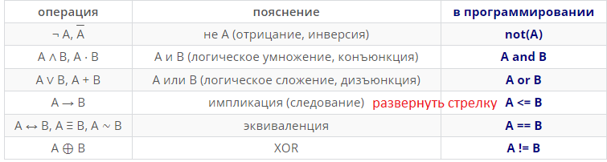

#### ! continue пишем чтобы строка не учитывалась 2 раза !
```python3
import itertools


def F(x, y, z, w):
    return (x and (not y)) or (y == z) or (not w)


for v1, v2, v3, v4 in list(itertools.permutations('xyzw', 4)):
    exec(
"""stroka1 = False
stroka2 = False
stroka3 = False
for x in [False, True]:
    for y in [False, True]:
        for z in [False, True]:
            for w in [False, True]:
                if int(F(x, y, z, w)) == 0:
                    if int(_V1) == 1 and int(_V3) == 0 and int(_V4) == 0 and not stroka3:
                        stroka3 = True
                        continue
                    if int(_V1) == 1 and int(_V2) == 0 and int(_V4) == 0 and not stroka2:
                        stroka2 = True
                        continue
                    if int(_V2) == 0 and not stroka1:
                        stroka1 = True
                        continue

if stroka1 and stroka2 and stroka3:
    print("_V1_V2_V3_V4")
""".replace("_V1", v1).replace("_V2", v2).replace("_V3", v3).replace("_V4", v4))
```


